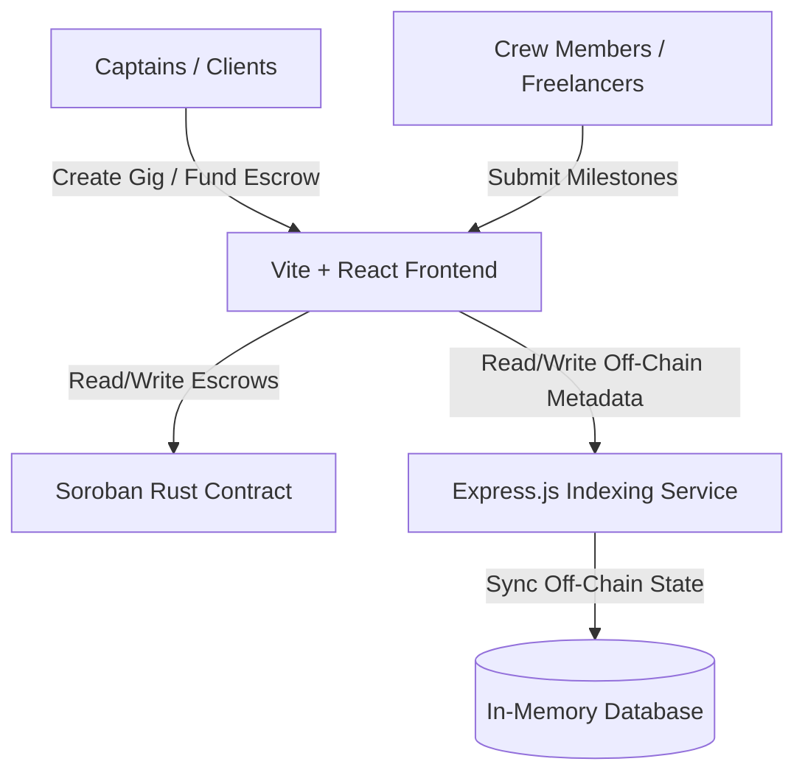

GIGNEX: Deep-Space Freelance Escrow Platform

```text
   ______   ______   ______  .__   __.  _______ ___   ___ 
  /  __  \ |_    _| /  ____| |  \ |  | |   ____|\  \ /  / 
 |  |  |  |  |  |  |  |  __  |   \|  | |  |__    \  V  /  
 |  |  |  |  |  |  |  | |_ | |  . `  | |   __|    >   <   
 |  `--'  | _|  |_ |  |__| | |  |\   | |  |____  /  .  \  
  \______/ |______| \______| |__| \__| |_______|/__/ \__\ 
```

**Gignex** is a futuristic, decentralized freelance marketplace designed for the Stellar ecosystem. It allows intergalactic clients (**Captains**) to hire spacefaring professionals (**Crew Members**) for complex mission tasks (**Gigs**). 

The platform guarantees trust, accountability, and secure payments using custom milestone-based **Soroban Smart Escrow Contracts**, backed by off-chain indexing services and a next-generation galaxy dashboard.

---

## 🛰️ Architecture Overview

The system is structured as a full-stack Web3 application with three key components:



1. **`contracts/gig_escrow` (Soroban/Rust)**: The on-chain core. Handles locking of funds (Cosmic Credits/XCC), mapping of milestones, contractor assignment, progress submission, client release approvals, and dispute protection.
2. **`backend` (Node.js/Express)**: Serves as the central repository for off-chain profiles, application text, detailed descriptions, skill ratings, and species metadata that would be too costly to store directly on-chain.
3. **`frontend` (Vite/React)**: A state-of-the-art space cockpit dashboard with stunning glassmorphic cards, space-dust animations, and Freighter wallet integration. Features a dynamic payment visualizer that traces energy flow during transaction execution.

---

## ⚡ Smart Contract API (Soroban)

The smart contract is written in Rust using the `soroban-sdk` and exposes the following functions:

| Function | Signer | Description |
|---|---|---|
| `create_gig(e, captain, crew, token, budget)` | Captain | Registers a new gig and assigns a crew member. Returns `gig_id`. |
| `add_milestone(e, gig_id, amount, description)` | Captain | appends a milestone with a locked funding balance. |
| `fund_milestone(e, gig_id, milestone_idx)` | Captain | Deposits the milestone's budget from the Captain's wallet to the contract escrow. |
| `submit_milestone(e, gig_id, milestone_idx)` | Crew | Marks a milestone as completed, ready for Captain's review. |
| `release_milestone(e, gig_id, milestone_idx)` | Captain | Transfers the milestone funds directly from the escrow to the Crew member. |
| `dispute_milestone(e, gig_id, milestone_idx)` | Captain / Crew | Locks the milestone into a dispute state for cosmic mediator intervention. |

---

## 📡 Off-Chain API (Backend)

The Express backend runs on port `3001` and serves the following REST endpoints:

- `GET /api/crew`: Get available crew members (skills, level, species, daily rate).
- `GET /api/gigs`: Fetch listed gigs, current statuses, and client details.
- `POST /api/gigs`: Create/Post a new galactic gig opportunity.
- `GET /api/gigs/:id`: Retrieve detailed gig metadata, applications, and milestone descriptions.
- `POST /api/gigs/:id/apply`: Submit a crew member proposal for a gig.

---

## 🚀 Quick Start Guide

### Prerequisites
- Node.js (v18+) & npm
- Rust & Cargo (to compile Soroban contracts)
- Stellar Freighter Wallet Extension (for frontend Web3 interaction)

---

### 1. Compile Smart Contracts
Navigate to the contracts folder:
```bash
cd contracts/gig_escrow
```
Build the contract into a WASM target:
```bash
cargo build --target wasm32-unknown-unknown --release
```
The compiled output is generated at:
`target/wasm32-unknown-unknown/release/gig_escrow.wasm`

---

### 2. Launch the Backend
Navigate to the backend folder:
```bash
cd backend
```
Install dependencies and run:
```bash
npm install
npm start
```
The server will boot on [http://localhost:3001](http://localhost:3001).

---

### 3. Run the Frontend Dashboard
Navigate to the frontend folder:
```bash
cd frontend
```
Install dependencies and launch the dev environment:
```bash
npm install
npm run dev
```
Open [http://localhost:5173](http://localhost:5173) in your browser to experience Gignex!

---

## 🌠 Aesthetic Identity

- **Nebula Backgrounds**: Custom dark space aesthetics using `#09090e` base with subtle radiant Radial Gradients `#1a0f30` (Nebula Purple) and `#0f2b30` (Teal Void).
- **Glassmorphism Grid**: High blur rates (`backdrop-filter: blur(12px)`) with thin neon glowing borders (`border: 1px solid rgba(0, 240, 255, 0.15)`).
- **Orbitron Headers**: Cybernetic fonts fit for spaceships.
- **Particle Stream payment**: Fluid animations simulating glowing stardust energy shifting from client to contractor upon escrow release.

---

## 🪐 License
MIT License - Gignex Decenteralized Technologies.
